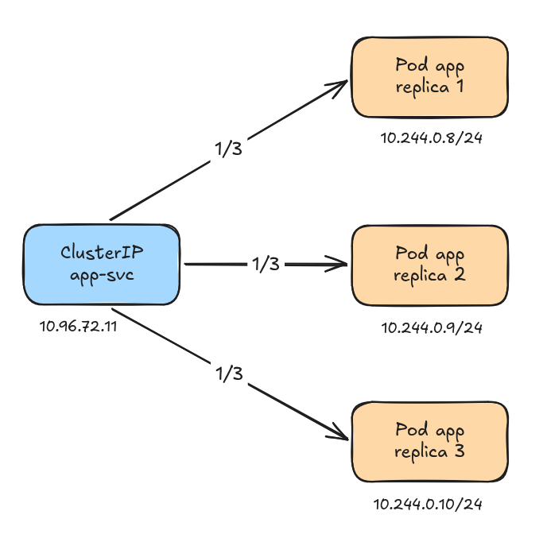
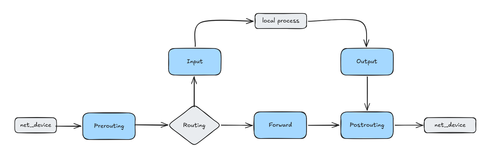
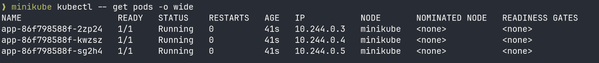
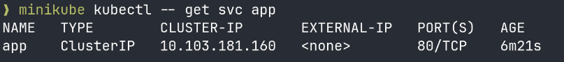
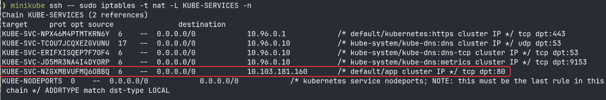
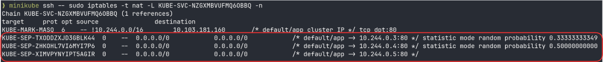
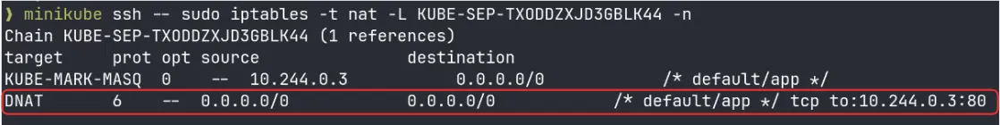

A ClusterIP is a Kubernetes resource that associates a stable virtual IP to a set of pods (a Service's endpoints). It is a dumb entity. A load balancer (usually kube-proxy) then redirects the packet to the real IP of one of the pod replicas. By default the packet is redirected to a random replica with no preference. P(1/N) (N being the number of replicas).



## Behind the scene

Because the ClusterIP is a dumb entity it cannot redirect the packets to its pods. So how does kube-proxy handle the load balancing, service -> pod?

To do that it writes rules into the kernel using, by default, iptables. It can also use IPVS for scale, or be replaced entirely by eBPF (e.g. Cilium), but iptables is the most common and this is the solution we will analyse in this article. iptables is a userspace translator CLI that installs rules into kernel tables. Those rules are then evaluated by netfilter, a core Linux kernel networking framework.

More information: https://thermalcircle.de/doku.php?id=blog:linux:nftables_packet_flow_netfilter_hooks_detail

Each packet in the kernel passes multiple steps (called hook points or just hooks) before arriving at its destination. There are 5 hooks in netfilter: Prerouting, Input, Forward, Output, Postrouting; a packet goes from left to right.



A packet takes the top path (Input → local process) when the destination IP belongs to the network namespace evaluating it, and the bottom path (Forward) when it belongs to another namespace and this one is just routing it onward.

At each hook point it is possible to register callback functions; the kernel calls the registered functions each time a packet goes through this hook, and each function returns a verdict (accept / drop / modify). The functions are sorted by a priority integer, netfilter walks that list low-to-high.

```plain
-200  conntrack
-150  mangle
-100  DNAT (rewrites the destination before routing)
   0  filter (accepts or drops the packet)
```

For a ClusterIP, the rewrite that matters is DNAT at the PREROUTING hook. The client connects to the virtual IP, and DNAT swaps the destination to a chosen pod's real IP _before routing_ (it must be pre-routing, since the new destination decides where the packet is routed).

A callback doesn't register rules. It walks a chain, an ordered list of rules. Each rule is `<match> + <target>`: match is a boolean condition that, if true, applies the target's verdict.

e.g.: `sudo iptables -t nat -A PREROUTING -d 10.96.72.11 --dport 80 -j DNAT --to-destination 10.244.0.9:8080`

Rewrites the destination of any packet headed to the ClusterIP 10.96.72.11 so it goes to the real pod 10.244.0.9:8080.

## Hands on

We're now going to prove what we just learned in a minikube cluster.

- We created a simple deployment app composed of 3 replicas
    - Pods IPs: 10.244.0.3, 10.244.0.4, 10.244.0.5



- Then we exposed a ClusterIP for the deployment
    - Virtual ClusterIP IP: 10.103.181.160



This command lists the rules kube-proxy installed in the `nat` table's `KUBE-SERVICES` chain, one per Service, showing which ClusterIP maps to which service chain.



- As we can see, kube-proxy added a new rule for our ClusterIP app. Every IP (0.0.0.0/0) having its destination set to 10.103.181.160 (our ClusterIP IP) is concerned by the rule.

Now we will follow this rule and read what it says.



Remember, rules are evaluated in order (top to bottom).

The first rule says that there is a P(1/3) that the first replica of our app deployment (10.244.0.3) will be the one receiving the packet.

- Pod 1: 1/3

Then if we go to the second rule it means the first pod has not received the packet, therefore there are 2 pods left. So we eliminate the first one for the draw and there is now a P(1/2) that the second replica (10.244.0.4) will be chosen.

- Pod 2: 2/3 × 1/2 = 1/3

Then if we go to the last rule it means the packet did not go to the second replica, therefore there is only one pod left in the draw and the packet is sent to the third replica (10.244.0.5).

- Pod 3: 2/3 × 1/2 × 1 = 1/3

We now follow one of these KUBE-SEP chains, the one for the first replica, to see what it actually does.



This is the last step of the trace. The chain contains a DNAT rule with tcp to:10.244.0.3:80, which rewrites the packet's destination to the real pod IP and port. So a packet that arrived for the ClusterIP 10.103.181.160 now has its destination set to 10.244.0.3:80, a real pod.
